# Juego creado en Android Studio: "Speed Ghost"
### Puedes probar el juego descargando el archivo APK: [SpeedGhost.apk](SpeedGhost.apk) 📥
Utilizamos el efecto parallax para el movimiento del mapa. Los personajes puedan esquivar los enemigos.
### Uno de los fondos principales
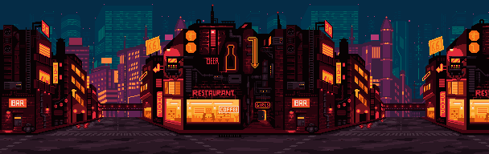

### Ghost (héroe del juego)
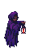 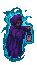 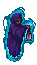 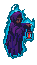 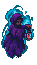
### Enemigos del juego
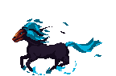 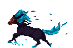 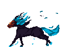 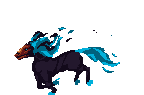
 
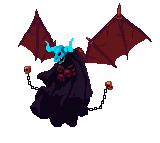 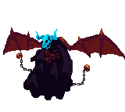 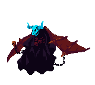 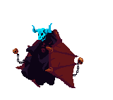
 
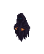  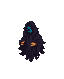  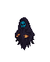  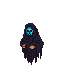
